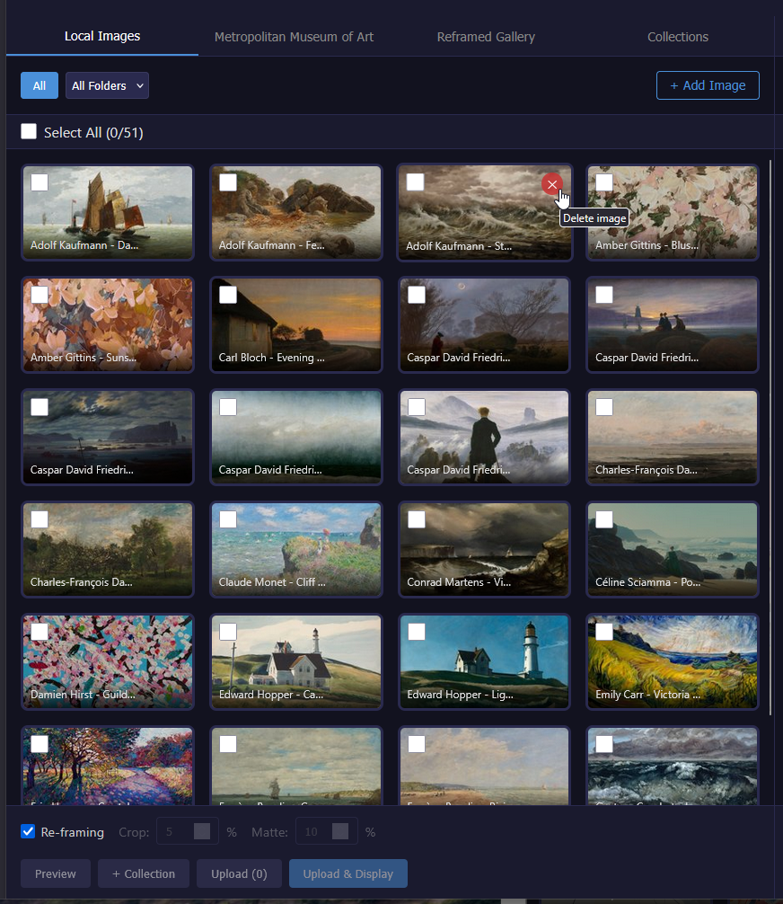
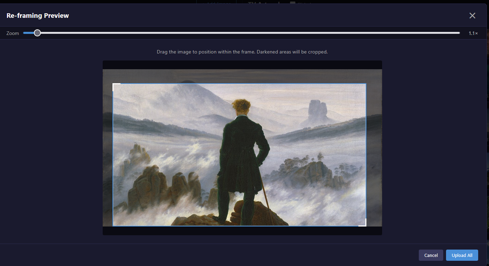
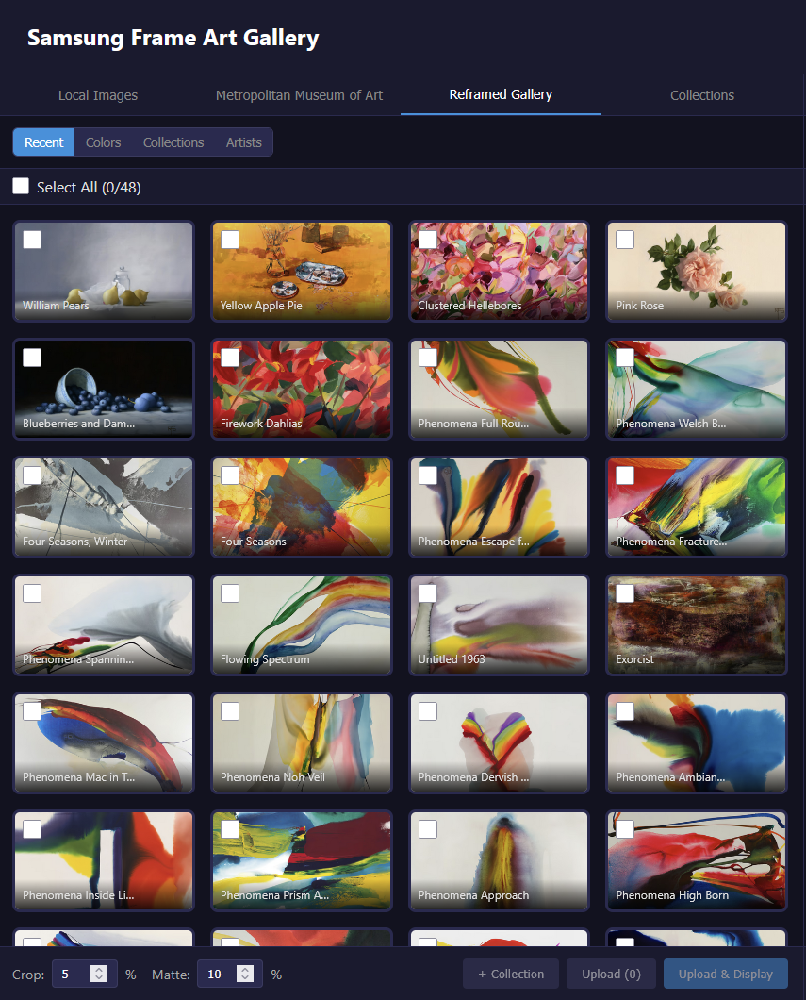

# Samsung Frame Art Gallery

A self-hosted web application for managing artwork on Samsung Frame TVs. Browse your local image collection, discover public domain masterpieces from the Metropolitan Museum of Art, or browse the curated fine art collection at Reframed Gallery — then upload to your TV with customizable framing options.

> **Note:** This is a fork of [samsung-frame-art-gallery](https://github.com/mcsdodo/samsung-frame-art-gallery) with a custom infrastructure stack including Caddy reverse proxy, automated GHCR releases, and enhanced security features.


## Features

### Image Sources
- **Local Images** - Browse JPEG, PNG, WebP, TIFF, and HEIC/HEIF files with folder navigation and smart thumbnails
- **Image Upload** - Upload images directly from your browser or phone — HEIC auto-converted to JPEG on arrival
- **Delete Local Images** - Remove uploaded or unwanted images directly from the gallery
- **Met Museum Collection** - Discover and upload public domain artwork from The Metropolitan Museum of Art's open collection (400,000+ works)
- **Reframed Gallery** - Browse the curated fine art collection at [reframed.gallery](https://www.reframed.gallery) — filter by color, collection, or artist and upload full-resolution images directly to your TV

### TV Integration
- **Auto TV Discovery** - Automatically finds Samsung Frame TVs on your network via SSDP
- **TV_IP Auto-Connect** - Set `TV_IP` in `.env` to auto-connect on startup and pre-fill the connection dialog
- **Batch Upload** - Upload multiple images to your TV at once with real-time progress
- **Art Management** - View, display, and delete artwork on your TV
- **Slideshow Control** - Enable/disable and configure the TV's built-in slideshow
- **Live Preview** - See exactly how your images will look before uploading

### Image Processing
- **Smart Cropping** - Remove unwanted edges from images (0-50%)
- **Auto Matte** - Automatically add museum-style matting to fit the 16:9 frame
- **Re-framing Mode** - Fill the entire frame with draggable positioning and zoom (1×–5×), enabled by default, with touch support for mobile

### User Experience
- **Password Protection** - Optional single-password auth via `APP_PASSWORD` — asked once, remembered forever via cookie
- **Upload Progress** - Real-time per-image progress indicator during TV uploads (SSE streaming)
- **Responsive Design** - Split-panel desktop layout, tabbed mobile interface
- **Infinite Scroll** - Seamless browsing through large collections
- **Masonry Layout** - Beautiful variable-height image grid
- **Docker-Ready** - One-command deployment with automatic HTTPS via Caddy
- **Secure HTTPS** - Built-in reverse proxy with self-signed certificate support

## Screenshots

### Local Images with Masonry Layout
Browse your image collection with a beautiful masonry grid and TV artwork panel.



### Met Museum Collection Search
Search and browse public domain artwork from The Metropolitan Museum of Art.


### Preview with Crop & Matte
See how your images will look with cropping and automatic matting before upload.


### Re-framing Mode
Fill the entire frame with draggable positioning for single images.



### Reframed Gallery
Browse curated fine art filtered by color, collection, or artist and upload to your TV.



## Quick Start

### Prerequisites

- Docker and Docker Compose
- Samsung Frame TV (or any Samsung TV with Art Mode) on the same network
- A folder of images (optional - you can also use the Met Museum collection or upload directly)


### Installation

1. **Clone the repository**
   ```bash
   git clone https://github.com/yourusername/samsung-frame-art-gallery.git
   cd samsung-frame-art-gallery
   ```

2. **Configure your setup**

   Copy `.env.example` to `.env` and customize as needed:
   ```bash
   cp .env.example .env
   ```

   Edit `.env` to set your image directory and TV IP (if desired):
   ```env
   IMAGES_DIR=./images
   TV_IP=                                # Optional: pre-configure TV IP
   ```

3. **Start the application**
   ```bash
   docker compose up -d --build
   ```

   This will start a single container and use a Docker volume for persistent app data (including thumbnails) at `/app/data`. Thumbnails are stored at `/app/data/thumbnails` inside the container.

4. **Open the web UI**

   Navigate to `http://localhost:8080` (or your server's IP/hostname and port 8080).

5. **Connect to your TV**

   Click the TV status indicator in the header to discover and select your Samsung TV. If `TV_IP` is set in `.env`, the app auto-connects on startup and pre-fills the IP in the connection dialog.


### Using Pre-built Images from GHCR

Instead of building the image locally, you can use pre-built images from GitHub Container Registry:

1. **Use the GHCR-based compose file**
   ```bash
   cp .env.example .env
   docker compose -f docker-compose.ghcr.yml up -d
   ```

2. **Update the image reference** in `docker-compose.ghcr.yml` if needed
   - Replace `YOUR_USERNAME` with the actual GitHub username
   - Example: `ghcr.io/yourusername/samsung-frame-art-gallery:latest`

3. **Authenticate with GHCR** (if image is private)
   ```bash
   docker login ghcr.io -u yourusername -p YOUR_GITHUB_TOKEN
   ```

**Available image tags:**
- `latest` - Most recent stable release
- `1.0.0`, `1.1.0`, etc. - Specific version tags (semantic versioning)

**Benefits:**
- No local build required - faster deployment
- Consistent images across environments
- Automatic updates via GitHub Actions on releases

## Versioning & Releases

This project uses **Semantic Versioning** and maintains a [CHANGELOG.md](CHANGELOG.md) documenting all changes.

### Release Process

1. Update `VERSION` file with new version number (e.g., `1.1.0`)
2. Add changes to `CHANGELOG.md` under the version header
3. Commit and push to main/master
4. GitHub Actions automatically:
   - Creates a GitHub Release with changelog content
   - Builds and pushes Docker image to GHCR
   - Tags image with version number and `latest`

### GitHub Container Registry

Images are automatically published to:
```
ghcr.io/YOUR_USERNAME/samsung-frame-art-gallery:VERSION
ghcr.io/YOUR_USERNAME/samsung-frame-art-gallery:latest
```

Build status and image metadata are visible on the [Packages](../../packages) page.

## Configuration

### Environment Variables

Create a `.env` file (see `.env.example`) to configure the application:

| Variable | Default | Description |
|----------|---------|-------------|
| `IMAGES_DIR` | `./images` | Path to your local image collection |
| `APP_PASSWORD` | - | Password to protect the app — asked once, stored in a cookie. Leave empty to disable |
| `TV_IP` | - | Pre-configure TV IP — auto-connects on startup and pre-fills the connection dialog |
| `DEFAULT_CROP_PERCENT` | `5` | Default edge crop percentage (0-50) |
| `DEFAULT_MATTE_PERCENT` | `10` | Default matte size percentage (0-50) |
| `THUMBNAILS_DIR` | `/app/data/thumbnails` | Directory for cached thumbnails — auto-detected in Docker, override if needed |
| `DOMAIN` | `artgallery.example.com` | Domain for HTTPS reverse proxy |

### HTTPS & Reverse Proxy

The application uses **Caddy** as a reverse proxy to automatically provide HTTPS with self-signed certificates. This setup:

- Listens on ports 80 (HTTP) and 443 (HTTPS)
- Automatically redirects HTTP → HTTPS
- Automatically generates and manages self-signed certificates
- Reads the domain from the `DOMAIN` environment variable (set in `.env`)
- Proxies all requests to the FastAPI backend

**Certificate Generation:**

Caddy automatically generates self-signed certificates on first start. No manual setup required. The certificates are stored in the `caddy_config` Docker volume and persist across restarts.

The domain is configured via the `DOMAIN` environment variable in `.env`, which is passed to Caddy at startup.

For **production use with Let's Encrypt**, update the Caddyfile:
```
{$DOMAIN}:443 {
  tls your-email@example.com  # Enable ACME (Let's Encrypt)
  reverse_proxy app:8080
}
```


### Docker Compose Service (Single Container)

```yaml
services:
   app:
      build:
         context: .
         dockerfile: docker/Dockerfile
      container_name: frame-app
      ports:
         - "8080:8080"
      volumes:
         - ${IMAGES_DIR:-./images}:/images
         - app_data:/app/data
      environment:
         - APP_PASSWORD=${APP_PASSWORD:-}
         - TV_IP=${TV_IP:-}
         - DEFAULT_CROP_PERCENT=${DEFAULT_CROP_PERCENT:-5}
         - DEFAULT_MATTE_PERCENT=${DEFAULT_MATTE_PERCENT:-10}
      restart: unless-stopped

volumes:
   app_data:
```

This setup uses a Docker volume for all app data and thumbnails, so data persists across container restarts.

## Usage

### Local Images Tab

1. Browse your image collection using folder navigation — supports JPEG, PNG, WebP, TIFF, HEIC/HEIF
2. Upload new images via the **+ Add Image** button (files are stored in the `uploads/` subfolder)
3. Delete images using the trash button that appears on hover
4. Select one or more images by clicking on them
5. Use **Re-framing** mode (on by default) to fill the 16:9 frame — drag to pan, use the zoom slider (1×–5×) to crop tighter
6. Or adjust **Crop** and **Matte** percentages for the classic bordered look
7. Click **Preview** to see a before/after comparison
8. Click **Upload** or **Upload & Display** — a progress bar shows each image being sent

### Met Museum Tab

1. Browse highlighted works or filter by medium (Paintings, Drawings, etc.)
2. Use search to find specific artworks
3. Select works and preview/upload just like local images
4. All Met Museum images are public domain - free to use

### Reframed Gallery Tab

1. Choose a browse mode — **Recent**, **Colors**, **Collections**, or **Artists**
2. For Colors: pick a dominant color palette (Red, Blue, Gold, etc.)
3. For Collections / Artists: type to filter the list, then select
4. Select artworks and preview/upload just like local images — full-resolution images are downloaded directly

### TV Panel

1. View all artwork currently stored on your TV
2. Click any artwork to display it
3. Delete artwork you no longer want

### Upload Progress

When uploading multiple images, the action bar shows a real-time progress indicator:
- **Processing** phase: images are cropped, matted, and encoded in parallel
- **Uploading** phase: each image is sent to the TV sequentially (Samsung's WebSocket API is strictly sequential), showing current image name and count

## Development

### Local Setup

**Backend (with uv):**
```bash
# Install uv (if not already installed)
curl -LsSf https://astral.sh/uv/install.sh | sh

# Install dependencies and create virtual environment
uv sync

# Activate virtual environment
source .venv/bin/activate  # or `.venv\Scripts\activate` on Windows

# Run with hot reload
uvicorn src.main:app --reload --host 0.0.0.0 --port 8080
```

Thumbnails are cached in `data/thumbnails/` relative to the working directory when running outside Docker. Set `THUMBNAILS_DIR` to override.

**Frontend:**
```bash
cd src/frontend
npm install
npm run dev
```

### Project Structure

```
samsung-frame-art-gallery/
├── src/
│   ├── main.py                    # FastAPI application entry point
│   ├── api/
│   │   ├── images.py              # Local image endpoints (browse + upload)
│   │   ├── tv.py                  # TV control & upload endpoints
│   │   ├── met.py                 # Met Museum API endpoints
│   │   ├── reframed.py            # Reframed Gallery endpoints
│   │   └── collections.py         # Collections endpoints
│   ├── services/
│   │   ├── tv_client.py           # Samsung TV WebSocket client
│   │   ├── tv_discovery.py        # SSDP-based TV discovery
│   │   ├── tv_settings.py         # Persistent TV selection
│   │   ├── tv_thumbnail_cache.py  # Persistent TV artwork thumbnail cache
│   │   ├── met_client.py          # Met Museum API client
│   │   ├── reframed_client.py     # Reframed Gallery scraper client
│   │   ├── image_processor.py     # Crop, matte, reframe processing
│   │   ├── thumbnails.py          # Local image thumbnails
│   │   └── preview_cache.py       # Preview generation cache
│   └── frontend/                  # Vue 3 + Vite SPA
│       └── src/
│           ├── views/
│           │   ├── LocalPanel.vue
│           │   ├── MetPanel.vue
│           │   ├── ReframedPanel.vue
│           │   ├── CollectionsPanel.vue
│           │   └── TVPanel.vue
│           ├── components/
│           │   ├── TvConnectionModal.vue
│           │   ├── PreviewModal.vue
│           │   └── CropSettings.vue
│           └── composables/
│               └── useUploadStream.js  # Shared SSE upload progress state
├── docker/
│   ├── Dockerfile              # Multi-stage build (frontend → python deps → runtime)
│   ├── entrypoint.sh
│   └── Caddyfile               # Caddy reverse proxy config
├── .github/workflows/
│   ├── build.yml               # Build and push Docker image to GHCR
│   ├── release.yml             # Create GitHub Release with changelog
│   └── test.yml                # Run tests on PRs (Ubuntu, macOS, Windows)
├── docker-compose.yml
├── docker-compose.ghcr.yml
├── pyproject.toml              # Python project configuration (uv)
└── requirements.txt
```

### Tech Stack

- **Backend:** FastAPI 0.115+, Python 3.13-slim, Pillow 11+, pillow-heif 0.18+, httpx 0.27+
- **Frontend:** Vue 3.5+, Vite 5.2+, Node 22-alpine (build)
- **Reverse Proxy:** Caddy 2-alpine (HTTPS, self-signed certificates)
- **TV Communication:** [samsung-tv-ws-api](https://github.com/NickWaterton/samsung-tv-ws-api)
- **External APIs:** [Met Museum Collection API](https://metmuseum.github.io/), [Reframed Gallery](https://www.reframed.gallery)
- **Infrastructure:** Docker 20.10+, Docker Compose 2.0+
- **CI/CD:** GitHub Actions (automatic builds to GHCR on version changes)

## Deployment

### Local Build & Run
```bash
docker-compose up -d --build
```
Builds image locally and starts services.

### From GHCR (Pre-built)
```bash
docker-compose -f docker-compose.ghcr.yml up -d
```
Uses pre-built image from GitHub Container Registry - faster startup, no build required.

## API Reference

### Local Images

| Method | Endpoint | Description |
|--------|----------|-------------|
| GET | `/api/images` | List images (optional `?folder=` filter) |
| GET | `/api/images/folders` | List available folders |
| GET | `/api/images/{path}/thumbnail` | Get image thumbnail |
| GET | `/api/images/{path}/full` | Get full image |
| POST | `/api/images/upload` | Upload image file (JPEG, PNG, WebP, TIFF, HEIC) |
| DELETE | `/api/images/{path}` | Delete a local image file |

### Met Museum

| Method | Endpoint | Description |
|--------|----------|-------------|
| GET | `/api/met/departments` | List museum departments |
| GET | `/api/met/highlights` | Get highlighted artworks |
| GET | `/api/met/medium/{medium}` | Get artworks by medium |
| GET | `/api/met/search?q=` | Search artworks |
| GET | `/api/met/object/{id}` | Get artwork details |
| POST | `/api/met/preview` | Generate processed preview |
| POST | `/api/met/upload` | Upload artwork to TV |

### Reframed Gallery

| Method | Endpoint | Description |
|--------|----------|-------------|
| GET | `/api/reframed/recent` | Recently added artworks (paginated) |
| GET | `/api/reframed/collections` | List all collections |
| GET | `/api/reframed/collection/{slug}` | Artworks in a collection (paginated) |
| GET | `/api/reframed/colors` | List available color filters |
| GET | `/api/reframed/color/{color}` | Artworks by dominant color (paginated) |
| GET | `/api/reframed/artists` | List all artists |
| GET | `/api/reframed/artist/{slug}` | Artworks by a specific artist (paginated) |
| POST | `/api/reframed/preview` | Generate processed preview |
| POST | `/api/reframed/upload` | Upload artwork to TV |

### TV Control

| Method | Endpoint | Description |
|--------|----------|-------------|
| GET | `/api/tv/config` | Get app config defaults |
| GET | `/api/tv/discover` | Scan for Samsung TVs |
| GET | `/api/tv/status` | Get TV connection status |
| GET | `/api/tv/settings` | Get saved TV selection (includes `env_ip`) |
| POST | `/api/tv/settings` | Save TV selection |
| GET | `/api/tv/artwork` | List artwork on TV |
| GET | `/api/tv/artwork/current` | Get currently displayed artwork |
| POST | `/api/tv/artwork/current` | Display specific artwork |
| DELETE | `/api/tv/artwork/{id}` | Delete artwork from TV |
| GET | `/api/tv/artwork/{id}/thumbnail` | Get artwork thumbnail |
| POST | `/api/tv/preview` | Generate upload preview |
| POST | `/api/tv/upload` | Upload local images to TV |
| POST | `/api/tv/upload/stream` | Upload with SSE progress events |
| GET | `/api/tv/slideshow` | Get slideshow status |
| POST | `/api/tv/slideshow` | Enable/disable slideshow |

## TV Compatibility

Tested with Samsung Frame TVs. Should work with any Samsung TV that supports Art Mode via WebSocket API.

**Supported TV API versions:**
- v3.x (older Frame models)
- v4.x+ (newer models with SSL)

**Upload performance:** The Samsung TV WebSocket art API is strictly sequential — each image must be fully transferred before the next begins. Upload speed is limited by the TV's hardware and the API design, not the server. Image processing (cropping, matting, encoding) is parallelized to minimize total time.

## Troubleshooting

**Stuck on login / forgot password:** Change `APP_PASSWORD` in `.env` and restart the container — all existing cookies are invalidated automatically (they are HMAC-signed with the password).

**Caddy/domain issues:** Verify `.env` has `DOMAIN=artgallery.example.com`. Restart: `docker-compose down && docker-compose up -d`


**Linux permissions:**
If images or thumbnails won't load, or you see errors like `[Errno 13] Permission denied: '/app/data/thumbnails'`, your bind-mounted directories may be owned by root or another user.

To fix this, ensure the container's appuser (UID 1000) owns the relevant folders. For the Docker volume, you can run:

```bash
docker compose exec app chown -R 1000:1000 /app/data
```

If you use bind mounts for images or data, you may also need:

```bash
sudo chown -R 1000:1000 ./images ./data
```

This is required on Linux when using bind mounts, since Docker creates new host folders as root by default. (You may need to run this after first starting the container.)

**HTTPS certificate warning:** Expected with self-signed certificates. Click "Advanced" → "Proceed" and browser will remember.

**TV not discovered:** Ensure TV is on same network and powered on (not deep standby). Set `TV_IP` in `.env` to skip discovery.

**Upload fails:** Verify TV is in Art Mode. Supported upload formats: JPEG, PNG, WebP, HEIC/HEIF (auto-converted to JPEG).

**Thumbnails missing:** Allow time for first-run processing; check read permissions on images directory.

**TV_IP not taking effect:** `TV_IP` auto-connects on startup only when no saved TV settings exist. If you previously connected to a different TV, clear saved settings via the connection dialog or restart with a fresh `app_data` volume.

## License

MIT License - see [LICENSE](LICENSE) file for details.
